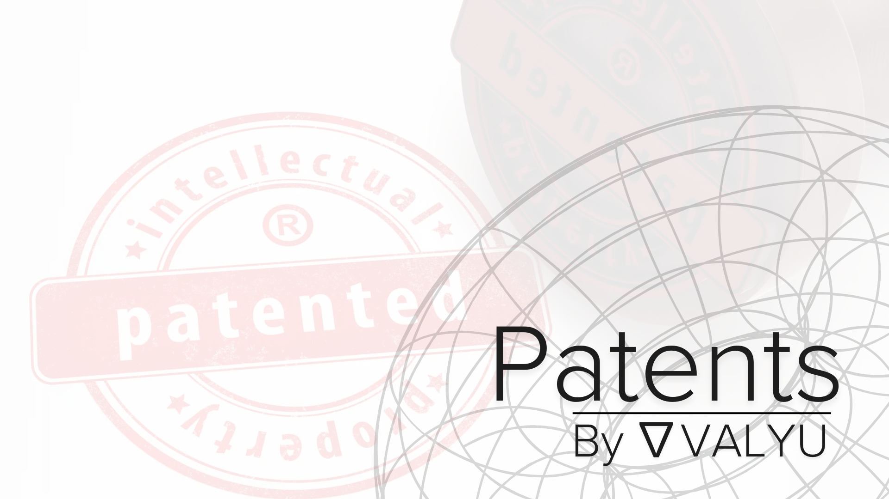

# PatentAI

> **The world's first conversational patent search** - Access USPTO patents through natural language. Powered by Valyu's patent search infrastructure.

**[Try the live demo](https://patents.valyu.ai)**



## The Problem

Traditional patent search is broken.

You're spending **$10,000-$50,000 per year** per seat on tools like PatSnap, Derwent Innovation, or Clarivate. Your team wastes **4-8 hours** crafting Boolean queries, learning CPC classifications, and sifting through irrelevant results. A single prior art search costs **$1,600-$3,200** in attorney time.

Meanwhile, your competitors are filing faster. Your R&D team can't check novelty without burning budget. Your startups are launching products blind to infringement risks because they can't afford proper FTO analysis.

**Every day without proper patent search is money on the table—or worse, money at risk.**

## The Solution

PatentAI eliminates the friction. Ask questions in plain English. Get comprehensive patent results in 5 minutes instead of 8 hours.

**Professional-grade patent intelligence, accessible to everyone.**

### What PatentAI Does

- **Conversational Search** - No Boolean syntax. No CPC codes. Just ask your question naturally.
- **95% Faster** - What takes 4-8 hours takes 5 minutes. Get back to high-value work.
- **Comprehensive Coverage** - USPTO, EPO, PCT, and international patents with English abstracts.
- **Advanced Analytics** - Execute Python for citation analysis, portfolio metrics, technology landscapes.
- **Interactive Visualizations** - Beautiful charts for competitive intelligence and trend analysis.
- **Local AI Models** - Run with Ollama or LM Studio for unlimited, private searches.
- **Multiple Search Modes** - Prior art, FTO analysis, competitive intelligence, citation analysis.

## Key Capabilities

### Patent Search Tools

- **Patent Search** - Semantic search across millions of patents (USPTO, EPO, PCT)
- **Prior Art Search** - Find anticipating references for patentability assessment
- **Competitive Intelligence** - Analyze competitor portfolios and technology strategies
- **Freedom-to-Operate** - Identify blocking patents and infringement risks
- **Citation Analysis** - Map forward/backward citations and identify influential patents
- **Technology Landscapes** - Visualize patent activity across technology domains
- **Interactive Charts** - Filing trends, portfolio comparisons, technology matrices
- **Python Analytics** - Statistical analysis, network metrics, portfolio valuation

## Quick Start

### Two Modes: Production vs Development

**Production Mode** (Default)
- Uses "Sign in with Valyu" for authentication
- Patent searches use your Valyu organization's credits
- OpenAI for LLM inference

**Development Mode** (Recommended for Local)
- No authentication needed - Uses local SQLite database
- Unlimited queries - No rate limits
- Ollama/LM Studio integration - Use local LLMs for privacy and unlimited usage
- Requires `VALYU_API_KEY` for patent search

### Prerequisites

**For Development Mode:**
- Node.js 18+
- npm or pnpm
- Valyu API key (get one at [platform.valyu.ai](https://platform.valyu.ai))
- Daytona API key (for code execution)
- [Ollama](https://ollama.com) or [LM Studio](https://lmstudio.ai) installed (optional but recommended)

### Installation

1. **Clone the repository**
   ```bash
   git clone https://github.com/yorkeccak/patents.git
   cd patents
   ```

2. **Install dependencies**
   ```bash
   npm install
   # or
   pnpm install
   ```

3. **Set up environment variables**

   Create a `.env.local` file in the root directory:

   ```env
   # Enable Development Mode
   NEXT_PUBLIC_APP_MODE=development

   # Valyu API Configuration (Required - powers all patent search)
   VALYU_API_KEY=your-valyu-api-key

   # Daytona Configuration (Required for Python execution)
   DAYTONA_API_KEY=your-daytona-api-key

   # Local LLM Configuration (Optional - for unlimited, private queries)
   OLLAMA_BASE_URL=http://localhost:11434
   LMSTUDIO_BASE_URL=http://localhost:1234

   # OpenAI Configuration (Optional - fallback if local models unavailable)
   OPENAI_API_KEY=your-openai-api-key
   ```

4. **Run the development server**
   ```bash
   npm run dev
   ```

5. **Open your browser**

   Navigate to [http://localhost:3000](http://localhost:3000)

## Setting Up Ollama (Recommended)

Ollama provides unlimited, private LLM inference on your local machine.

1. **Download Ollama App**
   - Visit [ollama.com](https://ollama.com) and download the app
   - Install and open the Ollama app

2. **Download a Model**
   ```bash
   ollama pull qwen2.5:7b    # Recommended - excellent tool support
   ollama pull llama3.1:8b   # Alternative
   ```

3. **Use in PatentAI**
   - Start the app in development mode
   - Ollama status indicator appears in top-right corner
   - Shows your available models - click to select which to use

## Example Queries

### Prior Art Search
- "Find patents similar to a neural network system that predicts protein structures using attention mechanisms"
- "Search for prior art on collapsible camping chairs with integrated solar panels"

### Freedom-to-Operate Analysis
- "Find patents that would block manufacturing transformer-based language models"
- "Check FTO for CRISPR gene editing in therapeutic applications"

### Competitive Intelligence
- "Show all AI patents filed by Google in 2023-2024"
- "Compare patent portfolios of Tesla vs BYD in battery technology"

### Technology Landscapes
- "Create a chart showing patent filing trends in solid-state batteries 2018-2024"
- "Show top assignees in autonomous vehicle perception patents"

## Architecture

- **Frontend**: Next.js 15 with App Router, Tailwind CSS, shadcn/ui
- **AI**: OpenAI GPT-4 + Ollama/LM Studio for local models
- **Data**: Valyu API for comprehensive patent data (USPTO, EPO, PCT)
- **Code Execution**: Daytona sandboxes for secure Python execution
- **Visualizations**: Recharts for interactive charts
- **Authentication**: Sign in with Valyu (production)

## Security

- Secure OAuth 2.1 authentication via Valyu
- Sandboxed code execution via Daytona
- No storage of sensitive patent strategies
- HTTPS encryption for all API calls
- Local model support for confidential work

## License

This project is licensed under the MIT License - see the [LICENSE](LICENSE) file for details.

## Contributing

Contributions are welcome. Submit a Pull Request.

## Acknowledgments

- Built with [Valyu](https://platform.valyu.ai) - The unified patent data API
- Powered by [Daytona](https://daytona.io) - Secure code execution
- UI components from [shadcn/ui](https://ui.shadcn.com)
- Local models via [Ollama](https://ollama.com) and [LM Studio](https://lmstudio.ai)

---

<p align="center">
  Built for patent professionals, inventors, and innovators who refuse to waste time on broken tools.
</p>

<p align="center">
  <a href="https://twitter.com/ValyuNetwork">Twitter</a> •
  <a href="https://www.linkedin.com/company/valyu-ai">LinkedIn</a> •
  <a href="https://github.com/yorkeccak/patents">GitHub</a>
</p>
